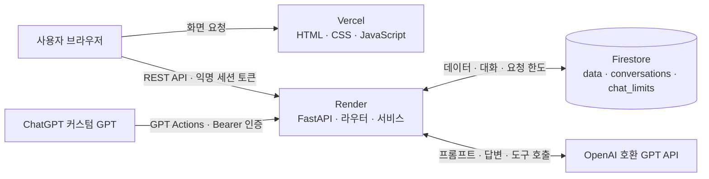

# CodysseyM1-2 — 전국 보통휘발유 가격 분석 AI 비서

2025년 전국 보통휘발유 일별 평균가격을 관리하고 통계로 설명하는 교육 프로젝트.
현재 구현: FastAPI 데이터 CRUD·요약 API, Firestore 저장소, 입력 검증, CORS, CSV 초기 가져오기,
GPT 요약 기반 채팅 호출 코드, 대화 자동/수동 저장·목록·불러오기·삭제,
바닐라 웹 화면·SVG 가격 그래프·CSV 다운로드·다크 모드.
Function Calling 및 GPT Actions용 읽기 API·스키마 생성기 구현.
필수 기능 중 실제 데이터 조회·AI 채팅·대화 자동 저장과 불러오기·양쪽 배포를 확인했다.
데이터 편집 인증 설정과 웹에서 추가·수정·삭제 검증을 완료했다. 2026-10-09에는 ChatGPT GPT Actions에 읽기 전용 요약 API를 연결하고, 실제 GPT 대화에서 기간별 기록 조회와 답변까지 확인했다.

## 기술 스택

| 구분 | 기술 | 역할 |
| --- | --- | --- |
| 언어 | Python 3.12 | 백엔드 API와 데이터 처리 |
| 백엔드 | FastAPI, Uvicorn | REST API와 애플리케이션 서버 |
| 입력 검증 | Pydantic | 요청 데이터의 형식과 범위 검증 |
| 데이터베이스 | Firebase Admin SDK, Cloud Firestore | 시계열 데이터와 대화 기록 저장 |
| AI 연동 | OpenAI Python SDK | 요약 정보를 활용한 AI 채팅 및 도구 호출 |
| 환경 설정 | python-dotenv | 로컬 환경 변수 불러오기 |
| 프론트엔드 | HTML, CSS, JavaScript, SVG | 프레임워크 없이 화면·차트 구현 |
| 배포 | Render, Vercel | 백엔드 API와 프론트엔드 호스팅 |

## 아키텍처 한눈에 보기



브라우저는 Vercel에서 화면을 받고 Render API와 직접 통신한다. Render는 요청을 검증하고 Firestore에서 데이터를 읽거나 저장하며, 채팅 요청에는 계산한 요약을 GPT 프롬프트에 넣어 답변을 만든다. GPT Actions는 같은 백엔드의 읽기 전용 요약 API를 호출한다. 비밀 키와 서비스 계정 정보는 Render에만 두고, 프론트엔드에는 공개 API 주소만 설정한다.

## 처음 실행하기

처음 설치할 때 필요한 것과 순서를 먼저 확인한 뒤 아래 단계를 따라간다. **각 터미널 코드 블록은 한 줄짜리 명령**이므로 위에서 아래로 한 줄씩 복사해 실행한다.

### 1. 준비물 확인

- **Python 3.10 이상**: 설치되어 있지 않다면 [Windows 공식 설치 안내](https://docs.python.org/3/using/windows.html) 또는 [macOS 공식 설치 안내](https://docs.python.org/3/using/mac.html)를 따른다. Linux는 배포판의 패키지 관리자로 설치한다.
- **Git**: 아래 `git clone`으로 받을 때 필요하다. Git이 없다면 [공식 설치 페이지](https://git-scm.com/install/)에서 설치한다. 또는 GitHub에서 ZIP을 내려받아 압축을 풀어도 된다.
- **Firebase 프로젝트와 Firestore**: Firebase Console에서 프로젝트를 만든 다음 **빌드 → Firestore Database → 데이터베이스 만들기**를 선택한다. 프로젝트 설정의 **서비스 계정** 화면에서 새 비공개 키(JSON)를 발급한다. 이 JSON은 서버가 Firestore에 접속할 때 쓰는 비밀번호와 같으므로 안전한 곳에 보관하고 저장소에는 넣지 않는다.
- **AI API 키와 모델 ID**: API 제공자 계정에서 발급받는다. API 호출은 사용량에 따라 비용이 들 수 있으므로 사용 가능한 모델과 한도를 먼저 확인한다.
- **배포할 때만 필요한 것**: GitHub 저장소, Render 계정, Vercel 계정이 필요하다. 로컬에서 실행하거나 테스트만 할 때는 Render/Vercel 계정이 없어도 된다. 배포 환경 변수와 순서는 [배포 문서](docs/deployment.md)를 참고한다.

프로젝트 패키지는 아래에서 `requirements-dev.txt`를 설치할 때 가상환경에 들어간다. Python 설치와 프로젝트 패키지 설치는 서로 다른 단계다.
화면과 실제 데이터를 실행할 때는 Firebase 설정이 필요하고, AI 채팅에는 AI API 키와 모델 설정도 필요하다. **자동 테스트만 실행하려는 경우에는 Firebase 계정과 AI 키를 준비하지 않아도 된다.**

### 2. Python 버전 확인

Python 설치 후 새 터미널을 열어 버전을 확인한다. 3.10 이상이어야 한다.

Windows PowerShell:

```powershell
python --version
```

macOS / Linux:

```bash
python3 --version
```

### 3. 프로젝트 폴더 준비

이미 저장소를 받았다면 이 단계를 건너뛰고 터미널에서 프로젝트 폴더를 연다. 아직 받지 않았다면 저장소 루트의 상위 폴더에서 복제한다.

```bash
git clone https://github.com/llcckk9935/CodysseyM1-2.git
```

복제한 폴더로 이동한다.

```text
cd CodysseyM1-2
```

### 4. 가상환경과 패키지 설치

이제부터는 저장소 루트에서 시작한다. 먼저 백엔드 폴더로 이동한다.

```text
cd backend
```

#### Windows PowerShell

가상환경을 만든다.

```powershell
python -m venv .venv
```

필요한 백엔드·테스트 패키지를 가상환경에 설치한다.

```powershell
.\.venv\Scripts\python.exe -m pip install -r requirements-dev.txt
```

환경 파일을 처음 만든다. 이미 `.env`가 있으면 건너뛰어 기존 설정을 보존한다.

```powershell
if (-not (Test-Path .env)) { Copy-Item .env.example .env }
```

#### macOS / Linux

가상환경을 만든다.

```bash
python3 -m venv .venv
```

현재 터미널에서 가상환경을 활성화한다.

```bash
source .venv/bin/activate
```

필요한 백엔드·테스트 패키지를 설치한다.

```bash
python -m pip install -r requirements-dev.txt
```

환경 파일을 처음 만든다. `-n` 옵션은 기존 `.env`를 덮어쓰지 않는다.

```bash
cp -n .env.example .env
```

### 5. 비밀 키와 서비스 설정

`backend/.env`를 텍스트 편집기로 연다. Windows에서는 다음 명령으로 메모장을 열 수 있다.

```powershell
notepad .env
```

macOS에서는 다음 명령으로 TextEdit에서 연다.

```bash
open -e .env
```

Linux에서는 사용 중인 텍스트 편집기로 `backend/.env`를 연다. 아래 항목을 `.env.example`에서 찾아 값을 채운다.

| 변수 | 무엇을 넣나 | 필요할 때 |
| --- | --- | --- |
| `FIREBASE_SERVICE_ACCOUNT_PATH` | `./firebase-service-account.json` | 데이터·요약·대화 API를 사용할 때. JSON 파일을 `backend` 폴더에 저장한다. |
| `OPENAI_API_KEY` | AI API 제공자에서 발급한 비밀 키 | AI 채팅 사용 시 |
| `OPENAI_MODEL` | 해당 키와 API 주소에서 지원하는 모델 ID | AI 채팅 사용 시 |
| `OPENAI_BASE_URL` | AI API 제공자의 호환 API 주소 | 사용하는 제공자에 따라 확인 |
| `ALLOWED_ORIGINS` | `http://localhost:3000` | 로컬 브라우저에서 프론트엔드를 열 때 |
| `ADMIN_API_TOKEN` | 직접 만든 긴 비밀 문자열 | 화면에서 데이터 추가·수정·삭제를 할 때 |

이 저장소의 `.env.example`에는 Codyssey 호환 API 주소가 기본 입력되어 있다. Codyssey API 키를 쓰면 그 주소와 키, 지원 모델을 함께 사용한다. OpenAI 공식 API를 쓰려면 `OPENAI_BASE_URL` 줄을 지워 기본 주소를 사용하고, 다른 호환 API를 쓰려면 해당 제공자의 주소·키·모델을 함께 설정한다. 서로 다른 제공자의 키와 주소를 섞으면 채팅 호출이 실패한다.

다운로드한 Firebase JSON 파일을 `backend/firebase-service-account.json`이라는 이름으로 저장한다. `.env`의 `FIREBASE_SERVICE_ACCOUNT_PATH`에 `./firebase-service-account.json`을 입력한다. 파일명에 `service-account`가 들어 있으므로 `.gitignore`가 GitHub 업로드를 막는다. JSON 파일을 다른 이름이나 위치에 두었다면 `.env`의 경로도 함께 바꾼다. JSON 전체를 환경 변수로 넣는 방법을 택하면 `FIREBASE_SERVICE_ACCOUNT_JSON`을 사용하고, `FIREBASE_SERVICE_ACCOUNT_PATH`는 비워 둔다. **두 변수 중 하나만 설정한다.**

`ALLOWED_ORIGINS`는 브라우저 주소와 정확히 같아야 한다. `localhost`와 `127.0.0.1`은 서로 다른 주소다. 주소를 바꾸면 `.env`의 허용 주소도 맞추고 백엔드를 재시작한다.

`ADMIN_API_TOKEN`은 데이터 편집용이다. 비밀번호 관리자에서 무작위로 만든 긴 값을 사용하고, OpenAI 키나 Actions 키와 다른 값을 쓴다. 프론트 화면에도 같은 값을 입력한다. 토큰을 설정하지 않아도 읽기와 채팅은 가능하지만 데이터 편집 요청은 거부된다.

`ACTIONS_API_KEY`와 `ACTIONS_PUBLIC_BASE_URL`은 GPT Actions를 직접 연결할 때만 필요한 선택 설정이다. 두 값은 로컬 웹 실행에는 필요하지 않다. Actions 키는 관리자 토큰과 별도로 만든다.

`.env`와 서비스 계정 키는 GitHub에 올리지 않는다. 이 저장소는 해당 파일을 `.gitignore`에 등록해 두었다. 채팅은 외부 API 사용량과 비용이 발생할 수 있다. 기본 요청 한도는 세션별 분당 5회, 서비스 전체 일일 100회다.

### 6. 데이터 준비 (필요한 경우)

화면에 기록이 보이려면 앱이 연결된 Firestore에 데이터가 있어야 한다. CSV 가져오기는 Firestore에 365개 날짜 기록을 쓰는 작업이다. 비어 있는 개발용 데이터베이스에만 실행하고, 이미 원본 데이터를 넣은 데이터베이스에서는 건너뛴다. 기존 날짜는 덮어쓰지 않는다.

새 터미널에서 저장소 루트부터 백엔드 폴더로 이동한다.

```text
cd backend
```

Windows PowerShell:

```powershell
.\.venv\Scripts\python.exe import_csv.py ../data/opinet_2025_original.csv
```

macOS / Linux에서는 가상환경을 활성화한다.

```bash
source .venv/bin/activate
```

그다음 CSV를 가져온다.

```bash
python import_csv.py ../data/opinet_2025_original.csv
```

### 7. 백엔드 실행

가상환경을 활성화한 **같은 터미널**에서 `backend` 폴더의 서버를 실행한다. 서버가 켜져 있는 동안 이 터미널을 닫지 않는다.

Windows PowerShell:

```powershell
.\.venv\Scripts\python.exe -m uvicorn app.main:app --reload
```

macOS / Linux:

```bash
python -m uvicorn app.main:app --reload
```

브라우저에서 [Swagger UI](http://127.0.0.1:8000/docs)를 연다.

### 8. 프론트엔드 실행

백엔드 서버를 켜 둔 상태에서 **새 터미널**을 연다. 저장소 루트에서 프론트엔드 폴더로 이동한다.

```text
cd frontend
```

Windows PowerShell:

```powershell
python -m http.server 3000
```

macOS / Linux:

```bash
python3 -m http.server 3000
```

브라우저에서 http://localhost:3000 을 연다. 로컬 프론트의 기본 백엔드 주소는 `http://127.0.0.1:8000`이다. `.env`의 `ALLOWED_ORIGINS`에는 프론트 주소인 `http://localhost:3000`을 넣는다.

### 테스트 실행

테스트는 실제 Firestore나 AI API를 호출하지 않고 테스트 대역을 사용하므로 비밀 키 없이 실행할 수 있다. 테스트만 하려면 5단계의 키 설정, 6단계의 데이터 가져오기, 서버 실행은 건너뛰어도 된다. 새 터미널에서 저장소 루트 기준으로 백엔드 폴더에 들어간다.

```text
cd backend
```

Windows PowerShell:

```powershell
.\.venv\Scripts\python.exe -m pytest -q
```

macOS / Linux에서는 가상환경을 활성화한다.

```bash
source .venv/bin/activate
```

테스트를 실행한다.

```bash
python -m pytest -q
```

### 자주 막히는 부분

| 보이는 문제 | 확인할 내용 |
| --- | --- |
| `ModuleNotFoundError: app` | 터미널의 현재 폴더가 `backend`인지 확인한다. 서버와 CSV 가져오기도 `backend`에서 실행한다. |
| `python` 명령을 찾을 수 없음 | Python을 설치한 뒤 새 터미널을 열고 버전을 다시 확인한다. Windows 설치에서 Python 명령을 사용할 수 있도록 설정했는지도 확인한다. |
| Linux에서 가상환경 생성 중 `ensurepip` 오류 | Ubuntu/Debian 계열은 Python 버전에 맞는 `python3-venv` 패키지가 추가로 필요할 수 있다. 배포판 안내에 따라 설치한 뒤 가상환경 생성부터 다시 실행한다. |
| Firestore 연결 오류 또는 503 | Firestore를 만들었는지, 서비스 계정 JSON 경로가 맞는지, `.env`가 `backend` 안에 있는지 확인한다. |
| 브라우저 CORS 오류 | `ALLOWED_ORIGINS`와 브라우저 주소가 완전히 같은지 확인하고, `.env`를 수정했다면 백엔드를 재시작한다. |
| 채팅 오류 503/502 | API 키·모델 ID·API 주소가 같은 제공자의 설정인지, 모델 접근 권한과 사용 한도가 있는지 확인한다. |
| 요약과 차트에 데이터가 없음 | 현재 `.env`가 가리키는 Firestore에 CSV를 가져왔는지 확인한다. 다른 Firebase 프로젝트에 가져온 데이터는 여기에 나타나지 않는다. |
| 배포한 사이트의 첫 화면 로딩이 오래 걸림 | Render 무료 서비스는 유휴 상태 뒤 첫 응답이 늦을 수 있다. 화면 안내에 따라 잠시 기다린다. |

`.env.example`의 기본값과 각 환경 변수의 용도는 아래 [설정](#설정) 절에서도 확인할 수 있다.

2026-10-09: 실제 Firestore에 원본 데이터 365개를 저장하고 배포 API 요약 응답을 확인했다.

## 설정

처음 로컬 실행에 필요한 항목은 [실행 전 필요한 설정](#5-비밀-키와-서비스-설정)을 따른다. 전체 변수는 다음과 같다.

| 변수 | 적용 위치·필요한 기능 | 설명 |
| --- | --- | --- |
| `FIREBASE_SERVICE_ACCOUNT_PATH` 또는 `FIREBASE_SERVICE_ACCOUNT_JSON` | 백엔드, Firestore 사용 | 서비스 계정 파일 경로 또는 JSON 값. 둘 중 하나만 설정한다. |
| `ALLOWED_ORIGINS` | 백엔드, 웹 브라우저 연결 | 허용할 프론트엔드 주소를 쉼표로 구분한다. 주소가 다르면 브라우저에서 CORS 오류가 난다. |
| `ADMIN_API_TOKEN` | 백엔드, 데이터 편집 | `X-Admin-Token` 인증에 쓴다. Vercel 공개 환경 변수에 넣지 않는다. |
| `OPENAI_API_KEY` | 백엔드, AI 채팅 | 서버 전용 AI API 키다. 배포 환경은 Codyssey 호환 API 키를 사용한다. |
| `OPENAI_BASE_URL` | 백엔드, 호환 AI API | `.env.example`의 값은 `https://copa.codyssey.kr/v1`이다. 공식 OpenAI API를 쓰면 이 변수를 제거한다. |
| `OPENAI_MODEL` | 백엔드, AI 채팅 | API 제공자 계정에서 사용할 수 있는 모델 ID. 배포 환경은 `gpt-5-mini`다. |
| `CHAT_MAX_COMPLETION_TOKENS` | 백엔드, AI 사용량 제한 | 요청당 출력 한도. 기본값 800, 설정 허용 범위 100~2000. |
| `CHAT_REQUESTS_PER_MINUTE` | 백엔드, AI 사용량 제한 | 익명 세션별 분당 채팅 요청 한도. 기본값 5, 최대 10. |
| `CHAT_DAILY_REQUEST_LIMIT` | 백엔드, AI 사용량 제한 | 서비스 전체의 UTC 기준 일일 채팅 요청 한도. 기본값 100, 최대 1000. |
| `ACTIONS_API_KEY` | Render, GPT Actions 연결 | Actions의 Bearer 인증 키. 관리자 토큰과 별도로 만든다. |
| `ACTIONS_PUBLIC_BASE_URL` | Render, GPT Actions 연결 | 배포된 백엔드의 HTTPS 주소다. |
| `API_BASE_URL` | Vercel 빌드 | 프론트엔드가 호출할 백엔드 주소. 공개 주소이며 비밀 키를 넣지 않는다. |

## API
- POST /api/data: date, value, memo 추가 (편집 인증 필요).
- GET /api/data: 전체 날짜순 목록.
- PUT /api/data/{id}: 같은 날짜의 값·메모 수정 (편집 인증 필요).
- DELETE /api/data/{id}: 삭제 (편집 인증 필요).
- GET /api/data/summary: 저장 기간·개수·평균·극값/날짜·월평균·추세·변화율.
ID는 YYYY-MM-DD. 날짜 변경은 삭제 후 추가. 날짜 중복은 409, 미존재는 404,
입력 오류는 422, DB 연결/편집 인증 미설정은 503.

## 분석 기준
평균 = 일별 가격 합계 / 실제 기록 수. 판매량 가중평균이나 주유비 합계가 아니다.
주간 비교 = 마지막 저장 날짜까지 7일 평균과 직전 7일 평균 비교.
14일의 날짜가 모두 존재할 때만 계산하며 빈 날짜를 임의로 채우지 않는다.
증가율 = (최근 평균 - 직전 평균) / 직전 평균 * 100.
기간 변화율 = (마지막 가격 - 첫 가격) / 첫 가격 * 100.
계산은 Decimal로 수행하고 표시값은 소수점 셋째 자리에서 반올림해 둘째 자리까지 표시한다.
추세 분류는 반올림 전 차이의 부호에 따른다. 최고·최저 동률 날짜는 모두 반환한다.
최근은 오늘이 아니라 마지막 데이터 날짜. 현재 가격·미래 예측·인과관계는 제공하지 않는다.

## 원본과 수정
data/opinet_2025_original.csv는 사용자가 제공한 원본을 그대로 복사했다.
출처: 한국석유공사 오피넷, 주유소 평균판매가격 제품별
https://www.opinet.co.kr/user/dopospdrg/dopOsPdrgSelect.do
2025-01-01~2025-12-31, 보통휘발유, 전국, 단위 원/리터 (사용자 다운로드 조건).
원본 화면과 전수 대조하지 않았다. 출처 이용조건에 관한 대화 판단은 별도 법률 검증이 아니다.
가져온 레코드는 원래 가격을 보관하며 값 수정 시 is_modified로 표시한다.
사용자가 추가한 값은 source=user로 표시한다.

## 구조와 설계 기준

`app/main.py`는 앱 초기화·CORS·라우터 등록을 담당한다. `routers/`는 HTTP 요청·인증·응답 오류, `services/`는 통계 계산·GPT 호출·도구 실행을 담당한다.
`repository.py`와 `conversations.py`는 Firestore 저장을 분리해 통계 계산과 API 테스트를 DB 없이 검증할 수 있게 했다.
Pydantic 모델은 날짜·양수 가격·소수 자릿수·문자열 길이·허용 필드를 검증하고 오류를 422로 반환한다.
`data`에는 날짜별 레코드를, `conversations`에는 messages와 당시 요약·도구 흔적을, `chat_limits`에는 요청 한도를 저장한다.
컨텍스트 주입은 DB에서 계산한 요약을 시스템 메시지에 포함하는 방식이다. 모델을 새로 학습시키는 과정은 없다.
CORS는 프론트 도메인의 브라우저 요청을 허용하는 설정이다. 서버 비밀 키는 Render 환경 변수로만 관리하며, Vercel API_BASE_URL은 공개 서버 주소다.

## 참조 문서
https://fastapi.tiangolo.com/tutorial/testing/
https://firebase.google.com/docs/firestore/manage-data/transactions

## 배포 상태
제출 저장소: https://github.com/llcckk9935/CodysseyM1-2
2026-10-09: 연결된 llcckk9935 계정의 저장소 읽기·쓰기 권한 확인.
Render 설정 파일 render.yaml 및 상세 준비 안내 docs/deployment.md를 마련했다.
Render 백엔드: https://codysseym1-2-k5mi.onrender.com
Swagger: https://codysseym1-2-k5mi.onrender.com/docs
Vercel 프론트: https://codysseym1-2-frontend-psi.vercel.app/
2026-10-09 배포 성공. Render ALLOWED_ORIGINS에 위 주소를 설정했다.
Vercel 프로젝트 Root Directory는 frontend로 설정하고 API_BASE_URL에 Render 서버 URL을 지정한다.
build.mjs가 환경 변수를 config.js로 내보낸다. 이 값은 공개되는 서버 주소이며 비밀 키를 넣으면 안 된다.

## 프론트 로컬 실행

백엔드 서버를 실행해 둔 상태에서 새 터미널을 연다. 저장소 루트에서 프론트엔드 폴더로 이동한다.

```text
cd frontend
```

Windows PowerShell:

```powershell
python -m http.server 3000
```

macOS / Linux:

```bash
python3 -m http.server 3000
```

http://localhost:3000 에 접속한다. 기본 API 주소는 http://127.0.0.1:8000.
백엔드 ALLOWED_ORIGINS에 http://localhost:3000을 설정한다.
127.0.0.1:3000으로 화면에 접속하면 그 주소도 별도로 허용해야 한다.
서버 연결 실패·콜드스타트·응답 생성·저장 실패 상태를 화면에서 표시한다.
편집 인증 토큰은 데이터 관리의 인증 설정에 입력하며 영구 저장하지 않는다.
CSV는 표시 중인 전체 기록을 내보내며 source, is_modified, unit을 포함한다.
스프레드시트 수식으로 오인될 수 있는 텍스트는 작은따옴표를 붙여 내보낸다.
가격 그래프는 기록 없는 날짜 구간을 연결하지 않는다. 목록은 15개씩 최신 날짜부터 표시한다.
다크 모드와 익명 세션 토큰은 브라우저 저장소에 유지한다. 저장소 사용이 막히면
익명 세션은 현재 페이지에서만 유지되므로 새로고침하면 이전 기록에 접근하지 못할 수 있다.

### 프론트 검증 현황
JavaScript 문법, 환경 변수 기반 빌드, HTML ID 연결 검사와 Playwright UI 테스트를 통과했다.
UI 테스트는 요약·차트·채팅·대화 기록·테마 유지·CSV 다운로드·데이터 편집/추가/삭제·안전한 텍스트 처리와 390×844 모바일 뷰포트를 확인한다.
배포된 브라우저에서 365개 기록·요약·가격 그래프·실제 AI 채팅·자동 저장·대화 불러오기, 임시 데이터 편집, CSV 다운로드를 확인했다.
실제 휴대전화 브라우저에서도 사용자가 화면과 주요 기능이 정상임을 확인했다. 이 수동 확인은 자동화된 Android/iOS 기기 테스트와는 별개다.
테스트 코드는 Playwright와 Chromium이 설치된 환경에서 실행한다.
UI_FIXTURE는 {rows:[...],summary:{...}} 형식의 JSON 경로,
UI_SCREENSHOT / UI_MOBILE_SCREENSHOT은 테스트 이미지 출력 경로다.
HTTP 픽스처 테스트의 AI 응답은 테스트용이며 제출 화면으로 사용하지 않는다.

## 현재 검증
2026-10-09: pytest 총 18개 통과. 데이터 CRUD 흐름, 편집 인증, 중복 날짜,
잘못된 날짜·가격·필드, CSV 기준 통계, 날짜 누락 시 추세 판단 중단, 동률 극값 검증.
추가 검증: 요약 프롬프트 주입, 자동 저장·후속 대화·수동 저장, 세션 간 접근 차단,
목록·불러오기·삭제, 요청 한도, AI 오류 및 저장 실패 처리, 토큰 설정 전달.
API 단위 테스트는 저장소와 AI 응답 대역을 사용한다. 실제 OpenAI 호출 성공을 의미하지 않는다.
별도 배포 검증: Firestore 365개 입력 완료, 요약 API HTTP 200 및 count=365 확인.
대화 저장 HTTP 201, 목록·전체 메시지 불러오기 HTTP 200, 검증용 대화 삭제 HTTP 204 확인.
ADMIN_API_TOKEN을 서버 환경 변수로 등록한 뒤 2026-01-01 검증용 기록을 추가(1700원), 수정(1701원), 삭제했다. 원본 365개와 평균 1680.32원/L를 복구 확인했다.
실제 백엔드 URL을 API_BASE_URL로 지정한 프론트 빌드 성공. Codyssey 호환 API의 gpt-5-mini 호출 HTTP 200 확인.
실제 질문에 평균 1,680.32원/L로 답변하여 요약 통계와 일치했다. 웹에서 자동 저장·이전 대화 불러오기 성공 확인.
요청은 토큰·횟수 한도 안에서 실행하며 API 사용 비용은 키 제공자의 정책에 따른다.

## 채팅과 대화 API
- POST /api/chat: `{ "message": "평균 가격은?", "conversation_id": null }`.
  기존 대화 UUID를 전달하면 이어서 대화한다. 반환: answer, conversation_id, saved, summary.
- POST /api/conversations: title, messages(role=user/assistant, content)로 수동 저장.
- GET /api/conversations: 해당 세션의 목록 (전체 messages는 포함하지 않음).
- GET /api/conversations/{id}: 전체 messages 포함한 특정 대화.
- DELETE /api/conversations/{id}: 해당 대화 삭제.
모든 대화 요청에는 X-Session-Token 헤더 필요. 클라이언트에서 암호학적으로 무작위인
최소 32자 토큰을 생성하고 유지한다. 서버는 해시를 저장하며 다른 세션의 대화는 404로 응답한다.
토큰을 잃으면 기록에 접근할 수 없다. 이는 계정 로그인 시스템이 아닌 익명 접근 방식이다.
토큰을 아는 사람은 기록에 접근할 수 있으므로 공유하거나 로그에 남기지 않는다.
대화 최대 100개 메시지, 질문 최대 2000자, 프롬프트에는 최근 12개 메시지만 포함한다.
매 요청마다 최신 저장 데이터 요약을 재계산해 시스템 프롬프트에 넣는다.
대화에 latest_summary로 마지막 답변 생성 시점의 요약을 함께 보관한다.
conversations 컬렉션 외에 chat_limits 컬렉션을 비용 제한용으로 사용한다.
호출 시도부터 한도에 포함하고 실패한 시도도 환급하지 않는다. 자동 SDK 재시도는 꺼두었다.
동시 대화 수정은 revision 검증으로 덮어쓰기를 막는다. 답변 생성 후 저장이 실패하면
답변은 반환하되 saved=false와 warning을 반환한다. 화면에서 저장 성공으로 표시하면 안 된다.
Function Calling으로 도구 선택을 최대 두 번 수행하고, 필요하면 마지막 답변 생성을 한 번 수행한다.
한 채팅 요청의 OpenAI 호출은 최대 3회. CHAT_MAX_COMPLETION_TOKENS는 호출별 제한이므로
최대 출력/추론 토큰 한도는 요청당 3배이며 입력 토큰 비용은 별도다.
세션별/전체 일별 제한은 OpenAI 개별 호출 수가 아닌 채팅 요청 시도 수에 적용된다.

## Function Calling
도구: get_data_summary(기간 필터 가능), get_conversation_history(현재 대화의 최근 12개 메시지만).
모델이 질문에 따라 tool_choice=auto로 선택하고, 서버가 허용 도구와 인자를 검증한 뒤 실행한다.
같은 요청의 원본 데이터 스냅샷을 사용해 중간 편집에 따른 통계 불일치를 줄인다.
도구 결과를 tool 메시지로 전달하고 GPT가 최종 답변을 작성한다.
도구의 reason은 모델이 제공한 짧은 선택 설명이며 모델 내부 사고 과정의 검증 자료가 아니다.
응답 tool_trace와 저장 기록 latest_tool_trace에 이름·인자·상태·결과 개수/기간을 남긴다.
일반 전체 통계 질문은 처음 주입된 요약만으로 답할 수 있어 도구를 호출하지 않을 수도 있다.
기간별 요약 질문은 get_data_summary를, 이전 대화 확인 질문은 get_conversation_history를 사용하도록 지시한다.
최대 2개 도구 실행, 최대 3회 GPT 호출. 허용하지 않은 도구나 잘못된 인자는 실행하지 않는다.

검증한 테스트 시나리오 (모델 응답 대역):
“2월 평균은?” → get_data_summary(2025-02-01~2025-02-28, reason) → 필터된 통계 → 최종 답변.
위 테스트의 1700원은 테스트 입력 2개 중 2월 기록 1개의 값이며 실제 2025년 2월 평균이 아니다.
현재 대화 조회의 범위 제한, 임의 delete_data 도구 거부, 두 번 호출 후 도구 선택 중단도 확인했다.
2026-10-09 실제 Codyssey 호환 GPT 호출 검증: “2025년 2월 1일부터 2월 28일까지의 평균 가격을 기간별 요약 도구로 조회해서 알려줘.”
모델이 get_data_summary를 선택했고 화면에 선택 근거 “사용자 요청: 2025-02-01~2025-02-28 평균 가격 조회”와 성공·28개 기록을 표시했다.
최종 답변 평균 1728.26원/L는 배포 요약 API의 2025-02 월평균과 일치한다. 전체 평균 1680.32원/L와 구분했다.
gpt-5-mini는 사용자 제공 Codyssey 호환 API 예시와 사용 가능한 설정을 따라 선택했다. 모델 간 성능 비교는 하지 않았다.

호출 흐름:
1. 사용자 질문과 전체 요약을 GPT에 전달.
2. GPT가 필요하면 도구 이름·날짜·짧은 선택 설명을 반환.
3. 서버가 인자를 검증하고 내부 요약/현재 대화 조회 서비스 실행.
4. 계산 결과를 GPT에 전달해 최종 답변 생성.
5. 답변·요약·도구 호출 기록을 conversations에 저장.

## GPT Actions
같은 요약 기능을 GET /api/actions/summary로 외부에 제공한다.
Authorization: Bearer 인증에 별도 ACTIONS_API_KEY를 사용한다.
ACTIONS_PUBLIC_BASE_URL은 실제 배포된 HTTPS 백엔드 주소다.
/actions/openapi.json은 공개할 조회 API 한 개만 포함하며 키 값은 포함하지 않는다.
상세 설정·검증 절차: docs/gpt-actions-setup.md. 미션 요구사항 재점검: [mission-audit.md](mission-audit.md).
2026-10-09: ACTIONS_API_KEY와 ACTIONS_PUBLIC_BASE_URL을 Render 환경 변수로 설정하고 배포 성공을 확인했다.
실제 HTTPS 검증: /actions/openapi.json 200, 정상 인증의 전체·2월·범위 밖 조회 200, 키 누락·잘못된 키 401, 역전된 날짜 범위 422.
전체 365개 평균 1680.32, 2월 28개 평균 1728.26, 범위 밖 count=0. [검증 결과](actions-api-verification.json).
이후 GPT 편집기에서 스키마를 가져오고 Bearer API 키 인증을 연결했다. Actions의 전체 기간 테스트에서 365개 평균 1680.32원/L를 반환했고, 저장한 GPT의 실제 대화에서 2025-02-01~2025-02-28 조회를 실행해 28개 평균 1728.26원/L로 답했다. 조회 기간·단위·최근 데이터 기준일을 화면에서 확인했다. 실제 대화 증거는 [GPT Actions 실제 호출 화면](gpt-actions-live-verified.png)이다. 비밀 키는 스크린샷과 저장소에 포함하지 않았다.

API 호출 방식 참고:
https://developers.openai.com/api/reference/resources/chat/subresources/completions/methods/create

## 제출 스크린샷

실제 배포 서비스에서 촬영했다. CRUD 화면의 2026-01-01은 검증용 임시 입력이며 촬영 후 삭제했다.


관리자 토큰은 Render의 ADMIN_API_TOKEN을 확인하여 웹의 편집 인증 설정에 입력한다. 공개 문서·프론트 코드에는 토큰을 싣지 않는다.
