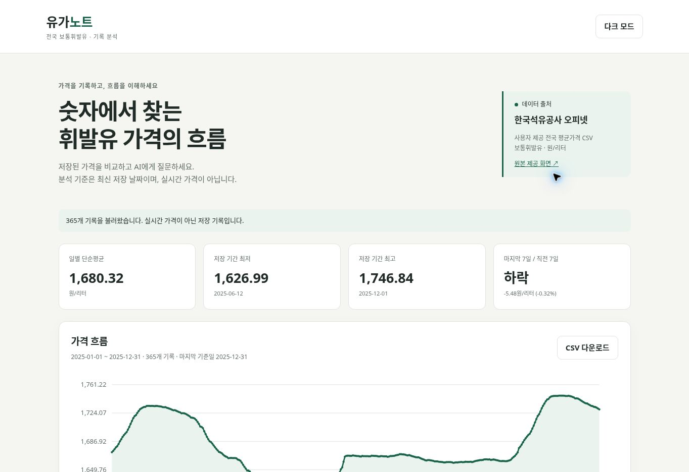
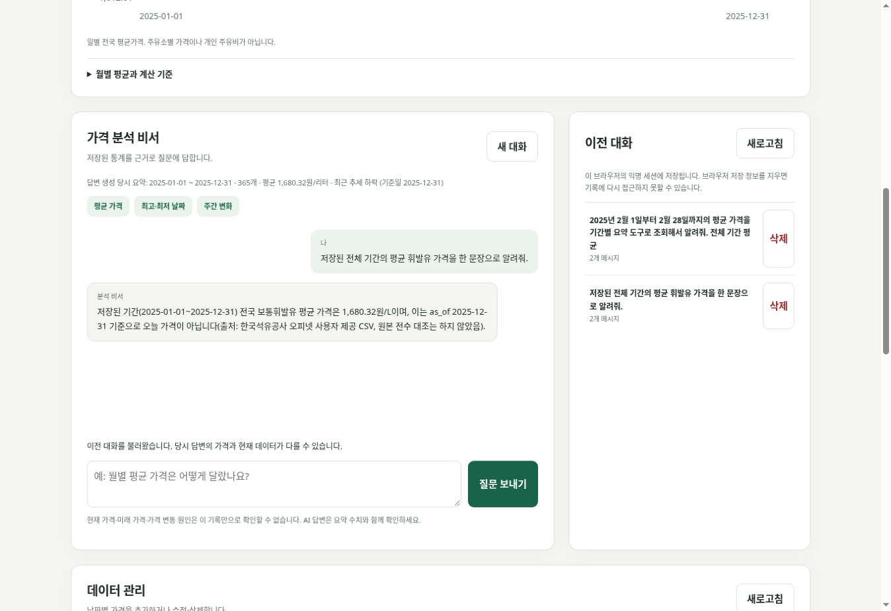
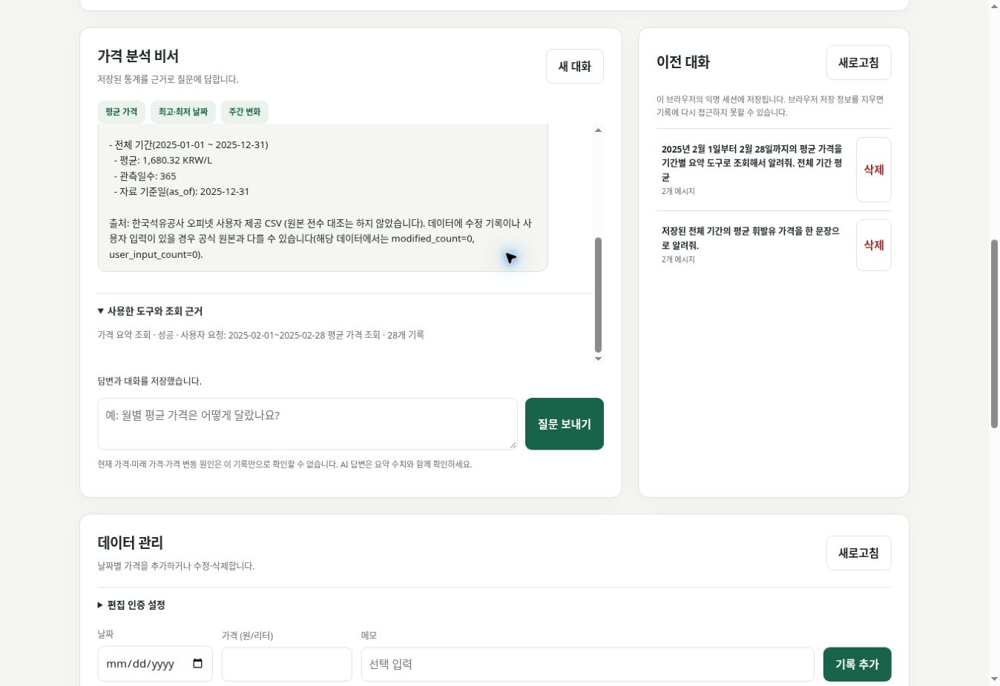
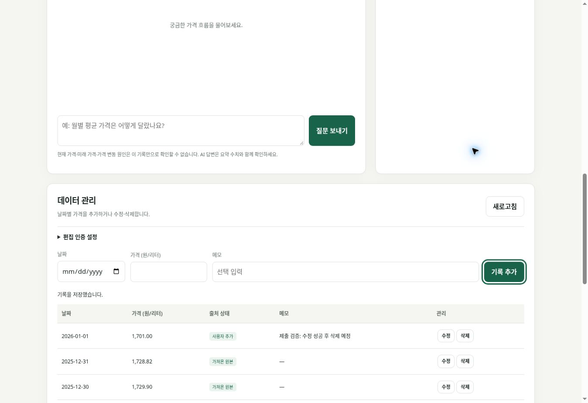
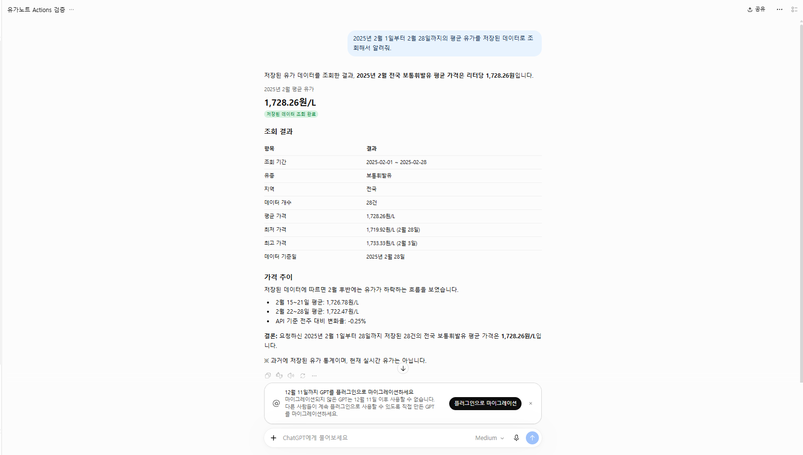

# CodysseyM1-2 — 전국 보통휘발유 가격 분석 AI 비서

2025년 전국 보통휘발유 일별 평균가격을 관리하고 통계로 설명하는 교육 프로젝트.
현재 구현: FastAPI 데이터 CRUD·요약 API, Firestore 저장소, 입력 검증, CORS, CSV 초기 가져오기,
GPT 요약 기반 채팅 호출 코드, 대화 자동/수동 저장·목록·불러오기·삭제,
바닐라 웹 화면·SVG 가격 그래프·CSV 다운로드·다크 모드.
Function Calling 및 GPT Actions용 읽기 API·스키마 생성기 구현.
필수 기능 중 실제 데이터 조회·AI 채팅·대화 자동 저장과 불러오기·양쪽 배포를 확인했다.
데이터 편집 인증 설정과 웹에서 추가·수정·삭제 검증을 완료했다. 2026-10-09에는 ChatGPT GPT Actions에 읽기 전용 요약 API를 연결하고, 실제 GPT 대화에서 기간별 기록 조회와 답변까지 확인했다.

## 기술 스택

Python 3.12 · FastAPI · Pydantic · Uvicorn · firebase-admin / Firestore · OpenAI Python SDK · python-dotenv.
프론트는 HTML/CSS/JavaScript와 SVG를 사용하며 프레임워크를 사용하지 않는다. Render와 Vercel에 배포했다.

## 실행 (Python 3.10 이상)
```bash
cd backend
python -m venv .venv
# Linux/macOS
source .venv/bin/activate
# Windows PowerShell: .venv\Scripts\Activate.ps1
pip install -r requirements-dev.txt
cp .env.example .env
# Windows: Copy-Item .env.example .env
# .env에 실제 Firestore 키, 허용 프론트 주소와 편집 인증 토큰 입력
uvicorn app.main:app --reload
```
Swagger: http://127.0.0.1:8000/docs
테스트: `python -m pytest -q` (실제 Firestore 대신 테스트 전용 저장소 사용).
초기 가져오기: `python import_csv.py ../data/opinet_2025_original.csv`
전체 파일 검증 후 날짜별로 생성한다. 기존 날짜는 건너뛰며 재실행해도 덮어쓰지 않는다.
2026-10-09: 실제 Firestore에 원본 데이터 365개를 저장하고 배포 API 요약 응답을 확인했다.

## 설정
- FIREBASE_SERVICE_ACCOUNT_JSON 또는 FIREBASE_SERVICE_ACCOUNT_PATH: 서버 전용 인증 정보.
- ALLOWED_ORIGINS: 쉼표로 구분한 프론트 주소.
- ADMIN_API_TOKEN: 편집 요청의 X-Admin-Token 값. Vercel 공개 환경 설정에 넣지 않는다.
- OPENAI_API_KEY: 서버 전용 API 키. 배포 서비스는 사용자 제공 Codyssey 호환 API 키를 사용한다.
- OPENAI_BASE_URL: 호환 API 주소. 배포값은 https://copa.codyssey.kr/v1. OpenAI SDK가 환경 변수에서 읽는다.
- OPENAI_MODEL: 배포값 gpt-5-mini. 다른 계정에서는 사용 가능한 모델을 설정한다.
- CHAT_MAX_COMPLETION_TOKENS: 기본 800, 100~2000으로 제한. 배포값 2000. 800 설정에서 미완료 응답이 발생해 늘렸다.
- CHAT_REQUESTS_PER_MINUTE: 세션별 UTC 분당 시도 한도, 기본 5 (최대 10).
- CHAT_DAILY_REQUEST_LIMIT: 서비스 전체 UTC 일별 시도 한도, 기본 100 (최대 1000).
- API_BASE_URL: Vercel 프론트 빌드 시 백엔드 주소를 지정한다.

## API
- POST /api/data: date, value, memo 추가 (편집 인증 필요).
- GET /api/data: 전체 날짜순 목록.
- PUT /api/data/{id}: 같은 날짜의 값·메모 수정 (편집 인증 필요).
- DELETE /api/data/{id}: 삭제 (편집 인증 필요).
- GET /api/data/summary: 저장 기간·개수·평균·극값/날짜·월평균·추세·변화율.
ID는 YYYY-MM-DD. 날짜 변경은 삭제 후 추가. 날짜 중복은 409, 미존재는 404,
입력 오류는 422, DB 연결/편집 인증 미설정은 503.

## 분석 기준
평균 = 일별 가격 합계 / 실제 기록 수. 판매량 가중평균이나 주유비 합계가 아니다.
주간 비교 = 마지막 저장 날짜까지 7일 평균과 직전 7일 평균 비교.
14일의 날짜가 모두 존재할 때만 계산하며 빈 날짜를 임의로 채우지 않는다.
증가율 = (최근 평균 - 직전 평균) / 직전 평균 * 100.
기간 변화율 = (마지막 가격 - 첫 가격) / 첫 가격 * 100.
계산은 Decimal로 수행하고 표시값은 소수점 셋째 자리에서 반올림해 둘째 자리까지 표시한다.
추세 분류는 반올림 전 차이의 부호에 따른다. 최고·최저 동률 날짜는 모두 반환한다.
최근은 오늘이 아니라 마지막 데이터 날짜. 현재 가격·미래 예측·인과관계는 제공하지 않는다.

## 원본과 수정
data/opinet_2025_original.csv는 사용자가 제공한 원본을 그대로 복사했다.
출처: 한국석유공사 오피넷, 주유소 평균판매가격 제품별
https://www.opinet.co.kr/user/dopospdrg/dopOsPdrgSelect.do
2025-01-01~2025-12-31, 보통휘발유, 전국, 단위 원/리터 (사용자 다운로드 조건).
원본 화면과 전수 대조하지 않았다. 출처 이용조건에 관한 대화 판단은 별도 법률 검증이 아니다.
가져온 레코드는 원래 가격을 보관하며 값 수정 시 is_modified로 표시한다.
사용자가 추가한 값은 source=user로 표시한다.

## 구조와 설계 기준

`app/main.py`는 앱 초기화·CORS·라우터 등록을 담당한다. `routers/`는 HTTP 요청·인증·응답 오류, `services/`는 통계 계산·GPT 호출·도구 실행을 담당한다.
`repository.py`와 `conversations.py`는 Firestore 저장을 분리해 통계 계산과 API 테스트를 DB 없이 검증할 수 있게 했다.
Pydantic 모델은 날짜·양수 가격·소수 자릿수·문자열 길이·허용 필드를 검증하고 오류를 422로 반환한다.
`data`에는 날짜별 레코드를, `conversations`에는 messages와 당시 요약·도구 흔적을, `chat_limits`에는 요청 한도를 저장한다.
컨텍스트 주입은 DB에서 계산한 요약을 시스템 메시지에 포함하는 방식이다. 모델을 새로 학습시키는 과정은 없다.
CORS는 프론트 도메인의 브라우저 요청을 허용하는 설정이다. 서버 비밀 키는 Render 환경 변수로만 관리하며, Vercel API_BASE_URL은 공개 서버 주소다.

## 참조 문서
https://fastapi.tiangolo.com/tutorial/testing/
https://firebase.google.com/docs/firestore/manage-data/transactions

## 배포 상태
제출 저장소: https://github.com/llcckk9935/CodysseyM1-2
2026-10-09: 연결된 llcckk9935 계정의 저장소 읽기·쓰기 권한 확인.
Render 설정 파일 render.yaml 및 상세 준비 안내 docs/deployment.md를 마련했다.
Render 백엔드: https://codysseym1-2-k5mi.onrender.com
Swagger: https://codysseym1-2-k5mi.onrender.com/docs
Vercel 프론트: https://codysseym1-2-frontend-psi.vercel.app/
2026-10-09 배포 성공. Render ALLOWED_ORIGINS에 위 주소를 설정했다.
Vercel 프로젝트 Root Directory는 frontend로 설정하고 API_BASE_URL에 Render 서버 URL을 지정한다.
build.mjs가 환경 변수를 config.js로 내보낸다. 이 값은 공개되는 서버 주소이며 비밀 키를 넣으면 안 된다.

## 프론트 로컬 실행
```bash
cd frontend
python -m http.server 3000
```
http://localhost:3000 에 접속한다. 기본 API 주소는 http://127.0.0.1:8000.
백엔드 ALLOWED_ORIGINS에 http://localhost:3000을 설정한다.
127.0.0.1:3000으로 화면에 접속하면 그 주소도 별도로 허용해야 한다.
서버 연결 실패·콜드스타트·응답 생성·저장 실패 상태를 화면에서 표시한다.
편집 인증 토큰은 데이터 관리의 인증 설정에 입력하며 영구 저장하지 않는다.
CSV는 표시 중인 전체 기록을 내보내며 source, is_modified, unit을 포함한다.
스프레드시트 수식으로 오인될 수 있는 텍스트는 작은따옴표를 붙여 내보낸다.
가격 그래프는 기록 없는 날짜 구간을 연결하지 않는다. 목록은 15개씩 최신 날짜부터 표시한다.
다크 모드와 익명 세션 토큰은 브라우저 저장소에 유지한다. 저장소 사용이 막히면
익명 세션은 현재 페이지에서만 유지되므로 새로고침하면 이전 기록에 접근하지 못할 수 있다.

### 프론트 검증 현황
JavaScript 문법, 환경 변수 기반 빌드, HTML ID 연결 검사와 Playwright UI 테스트를 통과했다.
UI 테스트는 요약·차트·채팅·대화 기록·테마 유지·CSV 다운로드·데이터 편집/추가/삭제·안전한 텍스트 처리와 390×844 모바일 뷰포트를 확인한다.
배포된 브라우저에서 365개 기록·요약·가격 그래프·실제 AI 채팅·자동 저장·대화 불러오기, 임시 데이터 편집, CSV 다운로드를 확인했다.
실제 휴대전화 브라우저에서도 사용자가 화면과 주요 기능이 정상임을 확인했다. 이 수동 확인은 자동화된 Android/iOS 기기 테스트와는 별개다.
테스트 코드는 Playwright와 Chromium이 설치된 환경에서 실행한다.
UI_FIXTURE는 {rows:[...],summary:{...}} 형식의 JSON 경로,
UI_SCREENSHOT / UI_MOBILE_SCREENSHOT은 테스트 이미지 출력 경로다.
HTTP 픽스처 테스트의 AI 응답은 테스트용이며 제출 화면으로 사용하지 않는다.

## 현재 검증
2026-10-09: pytest 총 18개 통과. 데이터 CRUD 흐름, 편집 인증, 중복 날짜,
잘못된 날짜·가격·필드, CSV 기준 통계, 날짜 누락 시 추세 판단 중단, 동률 극값 검증.
추가 검증: 요약 프롬프트 주입, 자동 저장·후속 대화·수동 저장, 세션 간 접근 차단,
목록·불러오기·삭제, 요청 한도, AI 오류 및 저장 실패 처리, 토큰 설정 전달.
API 단위 테스트는 저장소와 AI 응답 대역을 사용한다. 실제 OpenAI 호출 성공을 의미하지 않는다.
별도 배포 검증: Firestore 365개 입력 완료, 요약 API HTTP 200 및 count=365 확인.
대화 저장 HTTP 201, 목록·전체 메시지 불러오기 HTTP 200, 검증용 대화 삭제 HTTP 204 확인.
ADMIN_API_TOKEN을 서버 환경 변수로 등록한 뒤 2026-01-01 검증용 기록을 추가(1700원), 수정(1701원), 삭제했다. 원본 365개와 평균 1680.32원/L를 복구 확인했다.
실제 백엔드 URL을 API_BASE_URL로 지정한 프론트 빌드 성공. Codyssey 호환 API의 gpt-5-mini 호출 HTTP 200 확인.
실제 질문에 평균 1,680.32원/L로 답변하여 요약 통계와 일치했다. 웹에서 자동 저장·이전 대화 불러오기 성공 확인.
요청은 토큰·횟수 한도 안에서 실행하며 API 사용 비용은 키 제공자의 정책에 따른다.

## 채팅과 대화 API
- POST /api/chat: `{ "message": "평균 가격은?", "conversation_id": null }`.
  기존 대화 UUID를 전달하면 이어서 대화한다. 반환: answer, conversation_id, saved, summary.
- POST /api/conversations: title, messages(role=user/assistant, content)로 수동 저장.
- GET /api/conversations: 해당 세션의 목록 (전체 messages는 포함하지 않음).
- GET /api/conversations/{id}: 전체 messages 포함한 특정 대화.
- DELETE /api/conversations/{id}: 해당 대화 삭제.
모든 대화 요청에는 X-Session-Token 헤더 필요. 클라이언트에서 암호학적으로 무작위인
최소 32자 토큰을 생성하고 유지한다. 서버는 해시를 저장하며 다른 세션의 대화는 404로 응답한다.
토큰을 잃으면 기록에 접근할 수 없다. 이는 계정 로그인 시스템이 아닌 익명 접근 방식이다.
토큰을 아는 사람은 기록에 접근할 수 있으므로 공유하거나 로그에 남기지 않는다.
대화 최대 100개 메시지, 질문 최대 2000자, 프롬프트에는 최근 12개 메시지만 포함한다.
매 요청마다 최신 저장 데이터 요약을 재계산해 시스템 프롬프트에 넣는다.
대화에 latest_summary로 마지막 답변 생성 시점의 요약을 함께 보관한다.
conversations 컬렉션 외에 chat_limits 컬렉션을 비용 제한용으로 사용한다.
호출 시도부터 한도에 포함하고 실패한 시도도 환급하지 않는다. 자동 SDK 재시도는 꺼두었다.
동시 대화 수정은 revision 검증으로 덮어쓰기를 막는다. 답변 생성 후 저장이 실패하면
답변은 반환하되 saved=false와 warning을 반환한다. 화면에서 저장 성공으로 표시하면 안 된다.
Function Calling으로 도구 선택을 최대 두 번 수행하고, 필요하면 마지막 답변 생성을 한 번 수행한다.
한 채팅 요청의 OpenAI 호출은 최대 3회. CHAT_MAX_COMPLETION_TOKENS는 호출별 제한이므로
최대 출력/추론 토큰 한도는 요청당 3배이며 입력 토큰 비용은 별도다.
세션별/전체 일별 제한은 OpenAI 개별 호출 수가 아닌 채팅 요청 시도 수에 적용된다.

## Function Calling
도구: get_data_summary(기간 필터 가능), get_conversation_history(현재 대화의 최근 12개 메시지만).
모델이 질문에 따라 tool_choice=auto로 선택하고, 서버가 허용 도구와 인자를 검증한 뒤 실행한다.
같은 요청의 원본 데이터 스냅샷을 사용해 중간 편집에 따른 통계 불일치를 줄인다.
도구 결과를 tool 메시지로 전달하고 GPT가 최종 답변을 작성한다.
도구의 reason은 모델이 제공한 짧은 선택 설명이며 모델 내부 사고 과정의 검증 자료가 아니다.
응답 tool_trace와 저장 기록 latest_tool_trace에 이름·인자·상태·결과 개수/기간을 남긴다.
일반 전체 통계 질문은 처음 주입된 요약만으로 답할 수 있어 도구를 호출하지 않을 수도 있다.
기간별 요약 질문은 get_data_summary를, 이전 대화 확인 질문은 get_conversation_history를 사용하도록 지시한다.
최대 2개 도구 실행, 최대 3회 GPT 호출. 허용하지 않은 도구나 잘못된 인자는 실행하지 않는다.

검증한 테스트 시나리오 (모델 응답 대역):
“2월 평균은?” → get_data_summary(2025-02-01~2025-02-28, reason) → 필터된 통계 → 최종 답변.
위 테스트의 1700원은 테스트 입력 2개 중 2월 기록 1개의 값이며 실제 2025년 2월 평균이 아니다.
현재 대화 조회의 범위 제한, 임의 delete_data 도구 거부, 두 번 호출 후 도구 선택 중단도 확인했다.
2026-10-09 실제 Codyssey 호환 GPT 호출 검증: “2025년 2월 1일부터 2월 28일까지의 평균 가격을 기간별 요약 도구로 조회해서 알려줘.”
모델이 get_data_summary를 선택했고 화면에 선택 근거 “사용자 요청: 2025-02-01~2025-02-28 평균 가격 조회”와 성공·28개 기록을 표시했다.
최종 답변 평균 1728.26원/L는 배포 요약 API의 2025-02 월평균과 일치한다. 전체 평균 1680.32원/L와 구분했다.
gpt-5-mini는 사용자 제공 Codyssey 호환 API 예시와 사용 가능한 설정을 따라 선택했다. 모델 간 성능 비교는 하지 않았다.

호출 흐름:
1. 사용자 질문과 전체 요약을 GPT에 전달.
2. GPT가 필요하면 도구 이름·날짜·짧은 선택 설명을 반환.
3. 서버가 인자를 검증하고 내부 요약/현재 대화 조회 서비스 실행.
4. 계산 결과를 GPT에 전달해 최종 답변 생성.
5. 답변·요약·도구 호출 기록을 conversations에 저장.

## GPT Actions
같은 요약 기능을 GET /api/actions/summary로 외부에 제공한다.
Authorization: Bearer 인증에 별도 ACTIONS_API_KEY를 사용한다.
ACTIONS_PUBLIC_BASE_URL은 실제 배포된 HTTPS 백엔드 주소다.
/actions/openapi.json은 공개할 조회 API 한 개만 포함하며 키 값은 포함하지 않는다.
상세 설정·검증 절차: docs/gpt-actions-setup.md. 미션 요구사항 재점검: [mission-audit.md](mission-audit.md).
2026-10-09: ACTIONS_API_KEY와 ACTIONS_PUBLIC_BASE_URL을 Render 환경 변수로 설정하고 배포 성공을 확인했다.
실제 HTTPS 검증: /actions/openapi.json 200, 정상 인증의 전체·2월·범위 밖 조회 200, 키 누락·잘못된 키 401, 역전된 날짜 범위 422.
전체 365개 평균 1680.32, 2월 28개 평균 1728.26, 범위 밖 count=0. [검증 결과](actions-api-verification.json).
이후 GPT 편집기에서 스키마를 가져오고 Bearer API 키 인증을 연결했다. Actions의 전체 기간 테스트에서 365개 평균 1680.32원/L를 반환했고, 저장한 GPT의 실제 대화에서 2025-02-01~2025-02-28 조회를 실행해 28개 평균 1728.26원/L로 답했다. 조회 기간·단위·최근 데이터 기준일을 화면에서 확인했다. 실제 대화 증거는 [GPT Actions 실제 호출 화면](gpt-actions-live-verified.png)이다. 비밀 키는 스크린샷과 저장소에 포함하지 않았다.

API 호출 방식 참고:
https://developers.openai.com/api/reference/resources/chat/subresources/completions/methods/create

## 제출 스크린샷

실제 배포 서비스에서 촬영했다. CRUD 화면의 2026-01-01은 검증용 임시 입력이며 촬영 후 삭제했다.











관리자 토큰은 Render의 ADMIN_API_TOKEN을 확인하여 웹의 편집 인증 설정에 입력한다. 공개 문서·프론트 코드에는 토큰을 싣지 않는다.
